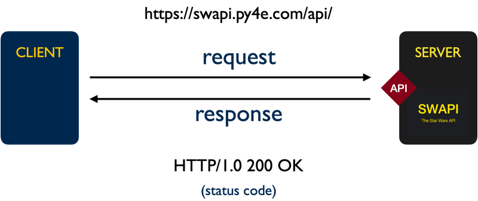

# SI 506 Lecture 23

## Goals

1. Understand the basics of the HTTP request/response communication cycle.
2. SWAPI Challenges

## Vocabulary

* __API__: Application Programming Interface that species a set of permitted interactions between
  systems.
* __HTTP__: The Hypertext Transport Protocol is an application layer protocol designed to facilitate
  the distributed transmission of hypermedia. Web data communications largely depends on HTTP.
* __JSON__: Javascript Object Notation, a lightweight data interchange format.
* __Querystring__: That part of a Uniform Resouce Locator (URL) that assigns values to specified
  parameters.
* __Resource__: A named object (e.g., document, image, service, collection of objects) that is both
  addressable and accessible via an API.
* __URI__: Uniform Resource Identifier that identifies unambiguously a particular resource.
* __URL__: Uniform Resource Locator is a type of URI that specifies the _location_ of a resource on
  a network and provides the means to retrieve it.
* __URN__: Uniform Resource Name is a type of URI that provides a unique identifier for a resource
  but does not specify its location on a network.

## 1.0 HTTP Request/Response cycle

The `swapi_get_test.py` script utilizes the `requests` module to send a message (known as a _request_)
to a remote server. The message is sent over HTTP (Hypertext Transfer Protocol), an application
layer protocol that supports data exchange between clients and servers. The server replies with a
message (known as a _response_). If the client is authorized to access the requested data (known
as a _resource_) identified by the provided Uniform Resource Identifier (in our case a URL) the
response will contain a representation of the resource, usually in the form of a JSON document.

HTTP and its extension HTTPS (Hypertext Transfer Protocol Secure) rely on lower level transport
layer protocols such as the Transmission Control Protocol (TCP) or the User Datagram Protocol (UDP)
to transmit packets of data between a client and a server. TCP privileges reliable
message delivery over speed and requires the server to acknowledge the receipt of data and permit
retransmission. UDP privileges speed over reliability and offers no guarantee of message delivery.
Exchanging messages with SWAPI leverages HTTPS over TCP and the still lower-level Internet Protocol
(IP).

An HTTP request consists of an HTTP verb (e.g., `GET`), a resource identifier (e.g.,
`https://swapi.py4e.com/api/people/10/`), the protocol version (`HTTP/1.1`) and optional headers and
an optional body (itself a resource). An HTTP response consists of the protocol version, status code
(e.g., `200`), status message (e.g., `OK`), headers, and an optional body (the requested resource).

The HTTP request methods utilized most frequently include `GET`, `PUT`, `POST`, and `DELETE`.
Other HTTP methods include `CONNECT`, `HEAD`, `OPTIONS`, `PATCH` and `TRACE`.

:bulb: For SI 506 you need only concern yourself with the `GET` method.

<br />
    
<br />

The Python [requests](https://docs.python-requests.org/) package abstracts away much of the
complexity associated with creating an HTTP request. In the case of `swapi_test.py` we need only
pass a URL to the `request` library's `get()` function to initiate a valid HTTP `GET` request. The
`get()` function's return value is an instance of `request.Response`, an object which contains the
JSON-encoded representation of the requested resource. We can access the `response.text` property
to return the JSON documents as a string. Better yet, we can call the `response.json()` method in
order to decode the JSON document into a dictionary.

## 2.0 Challenges

## Challenge 01

__Task__: Retrieve a SWAPI representation of Chewbacca and supplement the representation with
homeland and species data.

1. In `main` call the function `get_swapi_resource` passing the search string "chewbacca" and
   retrieve a response that contains a representation of the Wookiee Chewbacca (a.k.a Chewie).
   Assign the return value to a variable named `response`.

   :exclamation: The JSON response that is decoded into a dictionary is structured as follows:

   ```python
   {
     'count': 1,
     'next': None,
     'previous': None,
     'results': [
       {< Chewbacca >}
     ]
   }
   ```

2. Access the Chewbacca dictionary and assign it to variable named `chewie`.

3. Call the function `write_json` and write `chewie` to a file named `stu-chewie.json` as JSON.

4. Access the `homeworld` URL in `chewie` and retrieve the Wookiee's home planet by
   calling `get_swapi_resource` and passing the "homeworld" URL to it as an argument (no search string
   required). Assign the return value to the `chewie` dictionary's "homeworld" key.

5. Access the `species` URL in `chewie` and retrieve the Wookiee's species by
   calling `get_swapi_resource` and passing the URL to it as an argument (no search string
   required). Assign the return value to to the `chewie` dictionary's "species" key.

   :exclamation: Note that the expression `chewie['species']` resolves to a `list`.

6. Call the function `write_json` and write `chewie` to a file named `stu-chewie_enriched.json`.

## Challenge 02

__Task__: Implement the function `drop_data`. Refer to the Docstring for more information. Utilize
the `drop_keys` tuple to thin SWAPI entities of unneeded key-value pairs.

1. After implementing the function return to `main`. Call `get_swapi_resource` and retrieve a
   dictionary representation of a __T-65 X-wing__ starfighter. Assign the return value to a
   variable named `x_wing`.

   :bulb: Employ the search string "t-65 x-wing" rather than "x-wing" as there are two models of
   X-wing starfighters available for retrieval.

2. Call the function `drop_data` passing to it as arguments `x_wing` and `drop_keys`. Assign the
   return value to `x_wing`.

3. Call the function `write_json` and write `x_wing` to a file named `stu-x_wing.json` as JSON.

## Challenge 03

__Task__: Combine the T-65 X-wing data sourced from [Wookieepedia](https://starwars.fandom.com/) and
contained in the file  `wookieepedia_starships.csv` with the SWAPI `x_wing` dictionary.

1. Reimplement the function `read_csv_to_dicts` by converting the loop in the commented out code to a list comprehension.

   :bulb: The function's code block can be reduced to two (2) lines of code.

2. Call `read_csv_to_dicts` and retrieve the Starfighter data sourced from Wookieepedia. Assign the
   list of dictionaries to the variable named `wookiee_starships`.

3. Access the T-65 Starfighter dictionary in `wookiee_starships` and assign to a variable named
   `woookiee_x_wing`.

4. Update the `x_wing` dictionary with the `wookiee_x_wing` dictionary.

   :bulb: Visit w3school's
   ["Python Dictionary Methods"](https://www.w3schools.com/python/python_ref_dictionary.asp) page;
   there is a handy `dict` method available to accomplish this task.

5. Call the function `write_json` and write `x_wing` to a file named
   `stu-x_wing_enriched.json` as JSON.

## Challenge 04

__Task__: Replace the list of `x_wing` pilot URLs with dictionary representations of each pilot.
When adding the pilot dictionaries to `x_wing` drop unneeded key-value pairs.

:bulb: Leverage the `range` object to solve this challenge.

1. Utilize a `for` loop to update the `x_wing` `pilots` list. For each pilot URL encountered call
   `get_swapi_resource` to retrieve a representation of the pilot. Assign the return value to a variable named `pilot`. Then perform the following actions:

   1. Drop unneeded key-value pairs based on `drop_keys` and assign the return value to `pilot`.

   2. Then retrieve the pilot's home planet, drop unneeded key-value pairs and assign the return
      value to the pilot's `homeworld` key.

   3. Also retrieve the pilot's species&mdash;_if species data exists_&mdash; drop unneeded
      key-value pairs and assign the return value to the pilot's `species` key.

   4. Finally, assign the `pilot` to the appropriate `x_wing` list element.

2. After updating `x_wing` call the function `write_json` and write `x_wing` to a
   file named `stu-x_wing_pilots.json` as JSON.

## Challenge 05

__Task__: Drop the `x_wing` `pilots` key-value pair. Retrieve Luke Skywalker and the astromech
droid R2-D2 from SWAPI. Add `homeworld` and `species` dictionaries. Drop all unneeded key-value
pairs for person, droid, home planet and species. Assign Luke and R2-D2 as the `x_wing` crew
members.

1. Drop the `x_wing` `pilots` key-value pair. Pass __a single item tuple__ to `drop_data` to
   accomplish the task.

2. Retrieve a SWAPI representation of Luke Skywalker. Assign the return value to a variable named
   `luke`. Drop unneeded key-value pairs from `luke`.

3. Retrieve Luke's home planet and species. Drop unneeded key-value pairs for each. Assign each
   object to the `homeworld` and `species` keys in `luke`.

4. Retrieve a SWAPI representation of the astromech droid R2-D2. Assign the return value to a
   variable named `r2`. Repeat the same steps performed for `luke`, i.e., drop unneeded key-value
   pairs, retreive `homeworld` and `species` data.

5. Create a dictionary with two key-value pairs: `pilot` and `astromech_droid`. Assign `luke` as the
   "pilot" and `r2` as the "astromech_droid" values and assign the crew members to `x_wing` by
   a new "crew_members" key-value pair.

   ```python
   {'pilot': < luke >, 'astromech_droid': < r2 >}
   ```

6. Call the function `write_json` and write `x_wing` to a file named `stu-x_wing_crew.json` as JSON.
